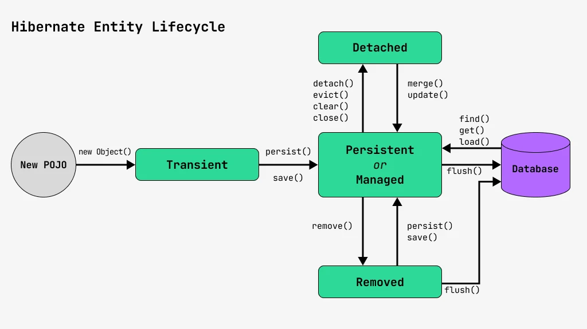
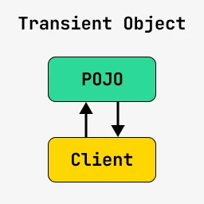
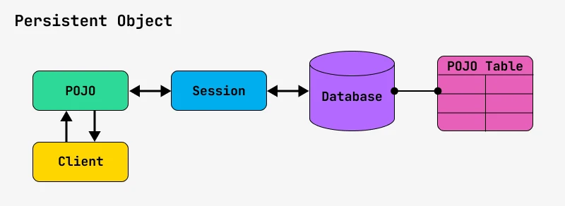
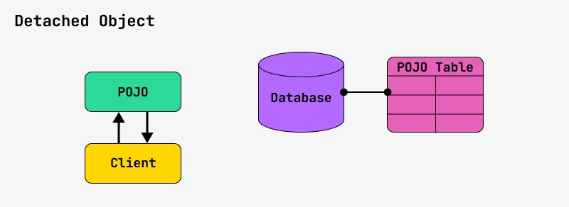
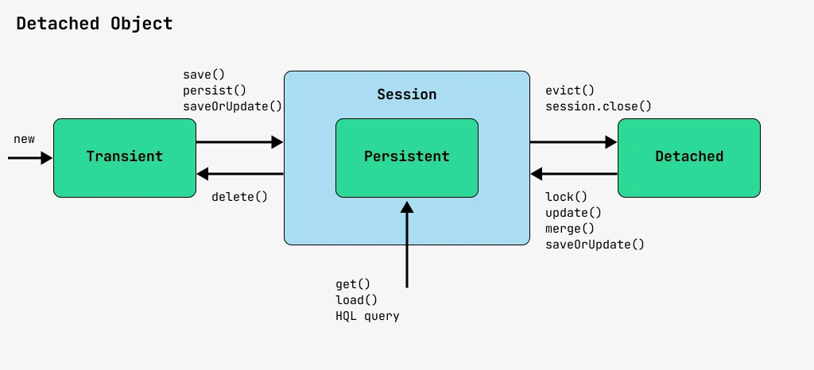

# Жизненный цикл Hibernate Entity-объектов
[1. Список состояний](#heading-states)

[2. Как сохранить объект в Hibernate](#heading-save-Entity)

[3. Как изменить объект в Hibernate](#heading-update_entity)

[4. Разные способы получения объекта](#heading-get-entity)

[5. Удаление объекта](#heading-remove-entity)

<h2 class="green" id="heading-states">Список состояний</h2>

У Entity-объекта может быть четыре состояния:
* Transient
* Persistent (or Managed)
* Detached
* Removed



#### Transient
каждый Entity объект, который ты создал явно с помощью Java-кода, 
а не загрузил из базы с помощью Hibernate, имеет статус Transient (прозрачный).
```
EmployeeEntity employee = new EmployeeEntity();
```
Статус Transient значит, что Hibernate понятия не имеет об этом объекте, 
и никакие действия с объектом не влияют на Hibernate, как и работа Hibernate на этот объект.

Такие объекты еще называются **POJO – Plain Old Java Object**. 
Этот термин часто используется как противоположность различным объектам с хитрым поведением. 
Вот помните Moc-объекты, которые создавал Mockito? Вот они не POJO.

Если некий клиентский код работает с объектом со статусом Transient, 
то их взаимодействие можно описать супер-простой схемой:



#### Persistent or Managed
Следующий самый распространенный случай – это объекты, связанные с движком Hibernate. Их статус называют Persistent (или же Managed). Способов получить объект с таким статусом ровно два:

* Загрузить объект из Hibernate.
* Сохранить объект в Hibernate.
Примеры:
```
Employee employee = session.load(Employee.class, 1);
Employee employee = new Employee ();
session.save(employee);
```
Такому объекту обычно соответствует какая-то запись в базе данных,
у него есть ID и тому подобное. Этот объект присоединен к сессии Hibernate’а, 
и вообще может быть представлен не реальным объектом, а неким proxy.

Вполне реальна ситуация, когда после вызова метода session.load(), 
тебе вернут некий объект-заглушку (proxy), 
и все обращения к базе данных будут выполняться только после вызова методов этого объекта. 
Но о таких деталях мы поговорим немного позднее.

А взаимодействие клиентского кода и объекта в статусе Managed можно описать вот такой картинкой:



#### Detached
Следующее состояние – это когда объект был отсоединен от сессии. То есть когда-то объект был присоединен к сессии Hibernate, но затем сессия закрылась или транзакция завершилась, и Hibernate больше не следит за этим объектом.

Пример:

```
session.close();
session.evict(entity);
```
В первом примере сессия была закрыта. Во втором случае мы явно указали,
что хотим отсоединить объект от сессии с помощью метода evict().

Новая схема взаимодействия кода и объекта будет выглядеть так:


И вот тут будет самое интересное. Если твой объект был получен из Hibernate, 
то велика вероятность, что тебе отдали некий proxy вместо реального объекта. 
И этот proxy-объект после отсоединения от сессии будет кидать исключения при вызове его методов.

Это самая частая проблема у всех новичков при работе с Hibernate. 
Тебе нужно точно знать в каждый момент времени ответ на такие вопросы, 
когда ты работаешь с Entity-объектом:

* У тебя реальный объект или только proxy от реального объекта?
* Ты сейчас в транзакции или нет?
* Это read-write транзакция или read-only транзакция?
* Объект управляется механизмом LazyLoading?
* Какие части объекта уже загружены в память, а какие будет загружены при обращении?
* Как твой объект соединен с зависимыми объектами?

Хорошая новость – в большинстве случаев все очевидно. Но тебе все равно нужно понимать,
как это все работает под капотом. Декларативное программирование оно такое – написать код 
можно за 10 минут, понять почему он не работает, как надо – за 10 часов :)

#### Removed
И последнее состояние, которое может быть у твоего Entity-объекта – это Removed. Как ты уже наверное догадался из его названия – это состояние удаленного объекта.

Такое состояние появляется по причине того, что если ты удалишь какой-то объект из базы, то Java-объект сразу никуда не исчезнет.
```
Employee employee = session.load(Employee.class, 1);
//после загрузки у объекта состояние Persisted

session.remove(employee);
//после удаления у объекта состояние Removed

session.save(employee);
//а теперь снова Persisted

session.close();
//а теперь состояние Detached
```

<h2 class="green" id="heading-save-Entity">Как сохранить объект в Hibernate</h2>
### Возможные варианты статуса объекта

Как ты уже наверное обратил внимание, когда объект присоединен к Hibernate, его состояние называется Persistent или Managed. 
Как правильно? Persist или Managed?

Можно и так, и так. Согласно спецификации JPA объект имеет статус Persist, 
а согласно спецификации Hibernate его состояние называется Managed.

В Hibernate работа с базой ведется через объект типа org.hibernate.Session. 
Согласно же JPA класс должен называться javax.persistence.EntityManager. 
На самом деле большой проблемы тут нет, так как оба типа являются интерфейсами.

Интерфейс org.hibernate.Session объявлен так:
```
interface Session extends java.lang.AutoCloseable, javax.persistence.EntityManager, HibernateEntityManager,    QueryProducer, java.io.Serializable, SharedSessionContract {
}
```
Поэтому в интерфейсе Session есть все методы, которые есть в интерфейсе EntityManager. 
Но также есть и свои, которые достались ему от более ранних версий Hibernate, 
когда еще не было спецификации JPA.

Описывается эта вся ситуация вот такой картинкой:



Давай же разберем все методы, которые есть у интерфейса session, а также нюансы их работы.

<h2 class="green" id="heading-update_entity">Как изменить объект в Hibernate</h2>
### Нюансы работы метода merge()

Если ты хочешь с помощью Hibernate изменить объект, который уже был сохранен в базе, то для этого тоже есть несколько методов.

Во-первых, это метод <span class="orange">merge()</span>, который обновляет информацию в базе на основе переданного объекта. При этом будет вызван SQL-запрос UPDATE. Пример:

```
User user = new User();
user.setName("Колян");
session.save(user);

session.evict(user);     // отсоединяем объект от сессии
user.setName("Маша");

User user2 = (User) session.merge(user);

```
### Нюансы работы метода update()
Также у Hibernate есть метод update(), который как и метод save() достался ему от предыдущих версий. С помощью этого метода можно только обновить данные уже сохраненного объекта. При этом будет вызван SQL-запрос UPDATE. Пример:
```
User user = new User();
user.setName("Колян");
session.save(user);

session.evict(user);     // отсоединяем объект от сессии
user.setName("Маша");

session.update(user);
```
Этот метод ничего не возвращает и не меняет существующий объект.
Если вызвать этот метод для нового объекта, то просто кинется исключение:
```
User user = new User();
user.setName("Колян");
session.update(user);   //тут кинется исключение
```
### Метод saveOrUpdate()
До появления JPA функцию метода persist() выполнял метод saveOrUpdate(). 
Его задачей было обновить в базе информацию по существующему объекту, 
а если такового нет, то создать его. Его почти всегда используют вместо методов save() и update().

В отличии от метода update(), он может менять передаваемый ему объект. 
Например, установить ему ID, который был присвоен при сохранении в базу данных. Пример:
```
User user = new User();
user.setName("Колян");
session.saveOrUpdate(user);   //объект будет записан в базу
```
Как это работает:

* если у передаваемого объекта установлен ID, то вызывается SQL-метод UPDATE
* если у передаваемого объекта ID не установлен, то вызывается SQL-метод INSERT


<h2 class="green" id="heading-get-entity">Разные способы получения объекта</h2>
### Метод get()
Если ты хочешь получить объект по его ID (или Primary Key), 
то для этого у Hibernate есть аж целых три метода:

* load()
* get()
* find()

Делают они одно и то же, однако есть нюансы. Общий формат метода get() имеет вид:
```
EntityClass имя = session.get(EntityClass.class, Object primaryKey);
```
Метод get() в качестве второго параметра принимает ID (Primary Key) объекта, 
который ему нужно вернуть. Затем загружает этот объект из базы и возвращает его. 
Пример:
```
User user = session.get(User.class, 2);
```
Если запись с таким ID не будет найдена в базе, то метод вернет null.

Метод load()
Второй метод для загрузки объекта – это метод load(). Общий формат метод load() имеет такой же:

<span class="frame">EntityClass имя = session.load(EntityClass.class, Object primaryKey);</span>

Однако его поведение отличается от метода get().

Во-первых, этот метод возвращает не реальный объект, а proxy: виртуальную заглушку.

Во-вторых, при использовании метода load() не происходит проверка, есть ли такая запись в базе. 
Вместо этого Hibernate сразу создает proxy-объект с переданным ID и возвращает его.

В-третьих, вся работа с базой данных будет происходить при вызове методов proxy-объекта. 
Если ты попытаешься вызвать, например, метод getName(), тогда и произойдет первое обращение к базе.
Пример:
```
User user = session.load(User.class, new Integer(123));
String name = user.getName(); //вот тут произойдет первое обращение к базе
```
Метод load() не стоит использовать для проверки наличия объектов в базе – он этого просто не покажет. Кроме того, если в него передать невалидный ID, например null, он просто вернет null.

### Метод find()
Метод find() достался интерфейсу Session от стандарта JPA. А как ты знаешь, этот стандарт описывает не просто сигнатуру методов, но и регламентирует поведение.

Этот метод работает точно так же, как и метод get(). Если объект по переданному ключу не был найден, то метод просто вернет null.
```
User user = session.find(User.class, -2); //метод вернет null
```
### Метод refresh()
Еще один полезный метод, который имеет отношение к загрузке объекта из базы – это метод refresh().

Помнишь метод persist(), который обновлял данные в базе на основе переданного объекта? Так вот, метод refresh() работает с точностью да наоборот: он обновляет существующий объект на основе данных из базы.

Такое поведение бывает нужно, если, например, при записи объекта в базу там вызываются различные хранимые процедуры, которые корректируют записанные данные.

В таких случаях бывает полезно перечитать объект из базы, если есть вероятность,
что он изменился.
Пример:
```
User user = new User();
user.setName("Колян");
session.persist(user);
session.flush();  //Принудительно вызвали SQL INSERT и вызов триггеров

session.refresh(user);
//тут дальше работаем с обновленным объектом
```
<h2 class="green" id="heading-remove-entity">Удаление объекта</h2>

### Удаление с помощью метода remove()
Наконец разберем удаление объекта. В принципе удалять объекты из базы очень просто, но как говориться, есть нюансы. И таких нюансов аж шесть:

* Удаление с помощью метода remove()
* Удаление за компанию
* Удаление по Orphan
* Удаление с помощью JPQL
* Удаление через NativeQuery
* softDeleted()
И начнем мы с самого очевидного решения — вызова метода remove().
```
User user = new User();
user.setName("Колян");
session.persist(user);  //добавляем объект в базу
session.flush();
session.clear();  //закрываем сессию

user = (User) session.find(User.class, user.getId() ); //заново получаем объект из базы
session.remove(user);
session.flush();
session.clear();  //закрываем сессию

//тут объект реально удален.
```
Реальная операция в базе будет выполнена после вызова метода flush() или закрытия транзакции.

### Каскадное удаление
Помнишь, когда мы изучали SQL, то зависимым таблицам можно было прописывать CONSTRAINT. И одна из них записывалась так:
<span class="frame orange">
CONSTRAINT ONDELETE REMOVE
</span>
Смысл ее был в том, что если у нас есть таблица, которая содержит дочерние сущности, 
то при уделении сущности-родителя нужно удалить все ее дочки.

Допустим, мы где-то храним персональную информацию пользователя и настроили CONSTRAINT в базе так, 
чтобы при удалении пользователя эти данные тоже удалялись. 
Тогда нам нужно просто удалить родительский объект и все дочерние объекты будут удалены 
на уровне базы:
```
User user = new User();
UserPrivateInfo info = new UserPrivateInfo();
user.setPrivateInfo(info);
session.persist(user);  //добавляем объект в базу, также в базу сохранится и объект info
session.flush();
session.clear();  //закрываем сессию

user = (User) session.find(User.class, user.getId() ); //заново получаем объект из базы
session.remove(user);
session.flush();
session.clear();  //закрываем сессию

//тут объекты user и info реально удалены из базы.
```
### Удаление по Orphan
Также есть еще один тип удаления, который называют удаление по Orphan.
Он чем-то похож на предыдущий вариант. Дочерняя сущность удаляется, 
когда разрывается ее связь с родительской сущностью. 
При этом родительская сущность обычно не удаляется.

Допустим, у нас есть пользователь, а у него есть список сообщений:
```
User user = new User();
UserMessage message = new UserMessage();
user.getMessageList().add(message);
session.persist(user);  //добавляем объект в базу, также в базу сохранится и объект message
session.flush();
session.clear();  //закрываем сессию

user = (User) session.find(User.class, user.getId() ); //заново получаем объект из базы
UserMessage message2 = user.getMessageList().get(0); //получаем сообщение пользователя
user.getMessageList().remove(message2);  //удаляем сообщение из списка
session.flush();
session.clear();  //закрываем сессию

//тут объект message2 реально удален из базы
```
Также есть важный нюанс, если мы хотим, чтобы Hibernate реализовывал такое поведение, его нужно явно указать при связывании двух сущностей с помощью аннотаций:
```
@Entity
public class User {

    @OneToMany(cascade = CascadeType.ALL, orphanRemoval = true)
    private List<UserMessage> messageList = new ArrayList<UserMessage>();

}
```
### Удаление через JPQL
Еще один интересный способ удалить объект – это написать запрос на HQL (или JPQL). 
Только не забудь в конце вызвать метод executeUpdate(), 
а не то Hibernate создает read-only транзакцию и никакого удаления у тебя не выйдет.

Пример:
```
User user = new User();
session.persist(user);  //добавляем объект в базу
session.flush();
session.clear();  //закрываем сессию

session.createQuery("delete from User where id = :id")
.setParameter("id", user.getId())
.executeUpdate();
```
Изменение в базе никак не изменит существующие Entity-объекты.

###Удаление через NativeQuery
Аналогично можно удалить и через вызов NativeQuery.

Пример:
```
User user = new User();
session.persist(user);  //добавляем объект в базу
session.flush();
session.clear();  //закрываем сессию

session.createNativeQuery("DELETE FROM user WHERE id = :id")
.setParameter("id", user.getId())
.executeUpdate();
```
Изменение в базе никак не затронет существующие Entity-объекты.

### Мягкое удаление
Иногда вместо удаления данных в базе бывает удобно просто пометить их как удаленные. Такие данные могут потом участвовать в различных сценариях. Во-первых, такое удаление легко обратимо – строки можно опять пометить как живые.

Во-вторых, такие удаленные данные полезно “складывать в архив”, ведь бывают случаи, когда поведение сервера регулируется законодательством и тому подобное. Однако, если ты будешь помечать твои данные как удаленные, то только ты будешь знать, что они удалены. Hibernate же по-прежнему будет находить эти данные, а также использовать их при сортировке.

Поэтому создатели Hibernate придумали специальную аннотацию, с помощью которой можно было бы помечать объекты как живые. Пример:
```
@Entity
@Where(clause = "DELETED = 0") //во всех WHERE будет добавляться “AND DELETED = 0”
public class User {
// маппинг полей

	@Column(name = "DELETED") // если значение в колонке DELETED == 0, то запись жива, если 1 - мертва
	private Integer deleted = 0;

	//геттеры и сеттеры

    public void softDeleted() {
    	this.deleted = 1; //помечаем запись как мертвую
    }
}
```
Чтобы пометить объект как удаленный нужно просто вызвать у него метод softDeleted():

```
User user = new User();
session.persist(user);  //добавляем объект в базу
session.flush();
session.clear();  //закрываем сессию

user = (User) session.find(User.class, user.getId() ); //заново получаем объект из базы
user.softDeleted(); //помечаем объект как удаленный
session.flush();
session.clear();  //закрываем сессию

//больше этот объект не будет находиться через Hibernate
```

<style>
.green{
color: green;
}
.orange{
color: orange;
}
.frame {

margin: 0 auto;
padding: 5px;
border:1px solid orange;
text-align: center;
}
</style>
