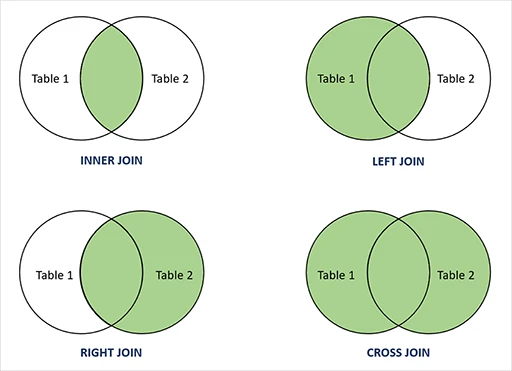

# Оператор OUTER JOIN

таблица1 LEFT JOIN таблица2 ON условие

таблица1 RIGHT JOIN таблица2 ON условие

SELECT * FROM employee e RIGHT JOIN task t ON e.id = t.employee_id

Типы JOIN-ов
Всего существует 4 типа JOIN-ов. Они представлены в таблице ниже:

|   | Краткая запись | 	Длинная запись    | 	Пояснение                                     |
|:--|:---------------|:-------------------|:-----------------------------------------------|
| 1 | 	JOIN          | 	INNER JOIN	       | Только записи, которые есть в таблицах А и Б   |
 | 2 | 	LEFT JOIN     | 	LEFT OUTER JOIN	  | Все строки без пары из таблицы А должны быть   |
 | 3 | 	RIGHT JOIN    | 	RIGHT OUTER JOIN	 | Все строки без пары из таблицы Б должны быть   |
 | 4 | 	OUTER JOIN    | 	FULL OUTER JOIN	  | Все строки баз пар из таблиц А и Б должны быть |

Для простоты, если мы представим таблицы в виде множеств, то JOIN можно будет отображать в виде картинки:




# Подзапросы
## Вложенные запросы в SQL

Язык SQL позволяет вкладывать одни запросы в другие запросы. Это дает возможность написать один очень большой запрос, который будет делать что-то большое и сложное, хотя при этом читабельность кода значительно снижается.

В зависимости от того сколько значений возвращают подзапросы, меняется область, где их можно применять. Всего возможны три варианта:

* Подзапрос возвращает одно единственное значение (одна колонка и одна строка).
* Подзапрос возвращает список значений (таблица с одной колонкой).
* Подзапрос возвращает таблицу (много колонок, любое количество строк).

```
  SELECT * FROM employee
  WHERE salary > (SELECT AVG(salary) FROM employee) 
 ```

задание звучит так: отобразите список всех сотрудников из таблицы employee, для которых нет задач в таблице task.

Давай тоже найдем решение в два этапа.

Сначала напишем запрос, который вернет id всех сотрудников, у которых есть задачи в таблице task. Только не забудьте две вещи:

убрать дубликаты – используйте ключевое слово DISTINCT.

уберите NULL-значения из результата.

```
SELECT DISTINCT employee_id FROM task
WHERE employee_id IS NOT NULL
```
Давай для удобства временно запишем его в виде последовательности: 1,2,5,4,6. Теперь напишем второй запрос – к таблице employee, которая вернет нам список сотрудников, чьи id не содержатся в первом списке:
```
SELECT * FROM employee  
WHERE id NOT IN (1,2,5,4,6)
```

А теперь можно, как и в предыдущем примере, совместить оба запроса, просто подставив вместо списка id тело первого запроса.
```
 SELECT * FROM employee 
   WHERE id NOT IN ( 
      	SELECT DISTINCT employee_id FROM task 
      	WHERE employee_id IS NOT NULL 
   )
```

# Подзапросы с таблицами
## Подзапрос возвращает таблицу


