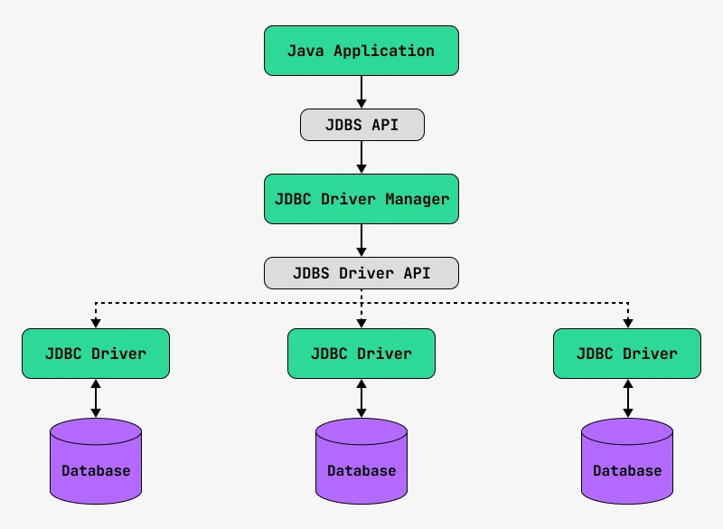

# Подключаемся к базе данных из Java-приложения
[Получаем данные из ResultSet](#foo)

[ссылка на заголовок](#header)

[Работа со временем](#rabota-so-vremenem)

[Получаем данные из ResultSet](#getdatafromResultset)

[click on this link](#my-multi-word-header)


## JDBC - Java DataBase Connectivity

* Connection - отвечает за подключение с базой данных
* Statement - отвечает за запрос к базе данных
* ResultSet - отвечает за результат запроса к базе данных

JDBC Driver Manager




<span class = "orange">mysql://localhost:3306/db_scheme</span>
* mysql – это протокол работы с сервером
* localhost – имя хоста в сети
* 3306 – порт, по которому идут запросы
* db_scheme – имя схемы (имя базы данных)

Также протокол может быть составным. Если все общение с сервером базы данных идет по зашифрованному каналу с помощью SSH-протокола, тогда URL может быть указан так:

<span class = "orange">ssh:mysql://localhost:3306/db_scheme</span>

Протокол – это не обязательно внешняя программа. Например, если ты работаешь с сервером по протоколу JNDI, то можешь указать его так:

<span class = "orange">jndi:mysql://localhost:3306/db_scheme</span>

А если хочешь работать по протоколу JDBC API, то нужно писать так:

<span class = "orange">jdbc:mysql://localhost:3306/db_scheme</span>

Когда ты пытаешься создать подключение к базе данных, то JDBC Driver Manager анализирует ваш SQL-db-URL и определяет имя JDBC-драйвера по имени протокола. Вот такая вот маленькая хитрость.

# Первая JDBC-программа

JDBC-драйвер для MySQL:
```
   	<dependency>
        	<groupId>mysql</groupId>
        	<artifactId>mysql-connector-java</artifactId>
        	<version>8.0.33</version>
    	</dependency>

```

JDBC-драйвер для PostgeSQL:
```
<dependency>
    <groupId>org.postgresql</groupId>
    <artifactId>postgresql</artifactId>
    <version>42.4.0</version>
</dependency>
```
JDBC-драйвер для Oracle:
```
<dependency>
    <groupId>com.oracle.database.jdbc</groupId>
    <artifactId>ojdbc8</artifactId>
    <version>21.5.0.0</version>
</dependency>
```
JDBC-драйвер для H2:
```
<dependency>
    <groupId>com.h2database</groupId>
    <artifactId>h2</artifactId>
    <version>2.1.214</version>
</dependency>
```
### Получаем данные из ResultSet

ResultSet имеет у себя внутри указатель на текущую строку. И последовательно переключает строки для их чтения с помощью метода next().

| 	 | Метод	            | Описание                                                    |
|---|-------------------|-------------------------------------------------------------|
| 1 | 	next()	          | Переключиться на следующую строку                           |
| 2 | 	previous()	      | Переключиться на предыдущую строку                          |
| 3 | 	isFirst()	       | Текущая строка первая?                                      |
| 4 | 	isBeforeFirst()	 | Мы перед первой строкой?                                    |
| 5 | 	isLast()	        | Текущая строка последняя?                                   |
| 6 | 	isAfterLast()    | 	Мы после последней строки?                                 |
| 7 | 	absolute(int n)	 | Делает N-ю строку текущей                                   |
| 8 | 	relative(int n)	 | Двигает текущую строку на N позиций вперед. N может быть <0 |
| 9 | 	getRow()	        | Возвращает номер строки                                     |

Чтобы получить первую строку, нужно хотя бы раз вызвать метод <span class="red">next()</span>.


### Получение данных из текущей строки
<span class = "orange">getType(номерКолонки)</span>

Впрочем, если у колонки есть имя, то можно получать и по имени колонки:

<span class = "orange">getType(имяКолонки)</span>

| SQL Datatype	 | getXXX() Methods |
|---------------|------------------|
| CHAR	         | getString()      |
| VARCHAR	      | getString()      |
| INT	          | getInt()         |
| FLOAT	        | getDouble()      |
| CLOB	         | getClob()        |
| BLOB	         | getBlob()        |
| DATE	         | getDate()        |
| TIME	         | getTime()        |
| TIMESTAMP	    | getTimestamp()   |

### Получение разных данных о ResultSet
JDBC есть специальный объект – интерфейс __ResultSetMetaData__.
```
Statement statement = connection.createStatement();
ResultSet results = statement.executeQuery("SELECT * FROM user");
ResultSetMetaData resultSetMetaData = results.getMetaData();
```
У интерфейса ResultSetMetaData есть очень интересные методы. Ниже приведу самые популярные из них:

|    |                               |                                                 |
|----|-------------------------------|-------------------------------------------------|
| 1  | 	getColumnCount()	            | Возвращает количество колонок результата        |
| 2  | 	getColumnName(int column)	   | Возвращает имя колонки                          |
| 3  | 	getColumnLabel(int column)	  | Возвращает description колонки                  |
| 4  | 	getColumnType()	             | Возвращает тип колонки: число (специальный код) |
| 5  | 	getColumnTypeName()	         | Возвращает тип колонки: строка                  |
| 6  | 	getColumnClassName()	        | Возвращает имя java-класса для типа колонки     |
| 7  | 	getTableName()	              | Возвращает имя таблицы                          |
| 8  | 	getCatalogName()	            | Возвращает имя каталога колонки                 |
| 9  | 	getSchemaName()	             | Возвращает имя схемы базы данных                |
| 10 | 	isAutoIncrement(int column)	 | Колонка поддерживает AUTO INCREMENT?            |
| 11 | 	isNullable()	                | Колонка может содержать NULL?                   |

## Data Type Matching in JDBC

| Метод     | 	Тип данных    | SQL                                     |
|-----------|----------------|-----------------------------------------|
| int       | getInt()       | 	NUMERIC, INTEGER, DECIMAL              |
| float     | getFloat()     | 	NUMERIC, INTEGER, DECIMAL, FLOAT, REAL |
| double    | getDoublel()   | 	NUMERIC, INTEGER, DECIMAL, FLOAT, REAL |
| Date      | getDate()      | 	DATE, TIME, TIMESTAMP                  |
| Time      | getTime()      | 	DATE, TIME, TIMESTAMP                  |
| Timestamp | getTimestamp() | 	DATE, TIME, TIMESTAMP                  |
| String    | getString()    | 	CHAR, VARCHAR                          |

### JDBC и NULL

Примитивные типы не могут принимать значения null, поэтому методы типа getInt() будут просто возвращать значение по умолчанию. Для int это 0, для float = 0.0f, для double = 0.0d и тому подобное.

А как тогда понять, что было в колонке: 0 или NULL? И на этот вопрос у партии есть ответ.

```
ResultSet results = statement.executeQuery("SELECT * FROM user");
results.next();
int level = results.getInt("level");

if (results.wasNull()) {
  System.out.println("Level is null");
} else {
  System.out.println("Level is " + level);
}
```
```
ResultSet results = statement.executeQuery("SELECT * FROM user");
results.next();
String name = results.getString("name");

if (results.wasNull()) {
  System.out.println("Name is null");
} else {
  System.out.println("User name is " + name);
}
```
## 2
## Работа со временем


<style>
span.orange{
margin: 0 auto;
padding: 15px;
border:1px solid orange;
color: orange
}
span.red{
color:red;
}
span.green{
color:green;
font-weight: bold;
}
</style>