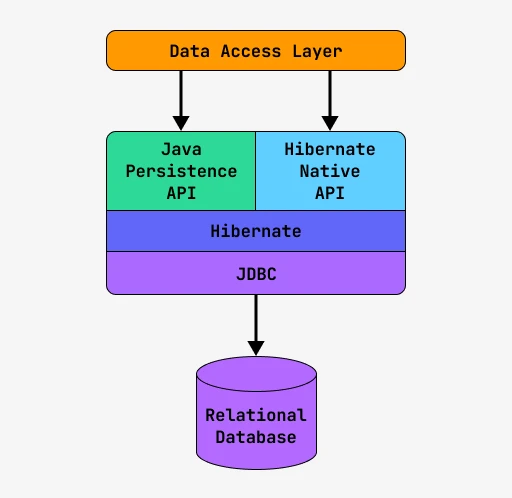
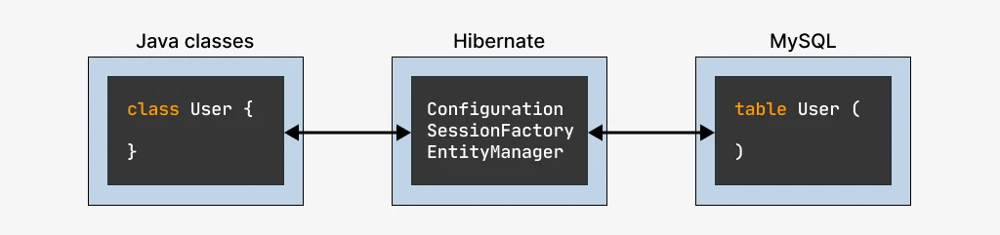

[1. Object Relational Mapping](#heading_orm)

[2. Маппинг классов в Hibernate](#heading_mapping)

[3. Подключаемся к базе данных](#header_connect_to_db)

[4. Работа с Entity-объектами](#heading_entity)

[5. Конфигурирование Hibernate](#heading_config)

<h2 class='heading' id='heading_orm'>Object Relational Mapping</h2>

ORM расшифровывается как Object-Relational Mapping и по сути является маппингом Java-объектов на SQL-запросы.

Ребята придумали очень простую вещь — каждой таблице в базе данных должен соответствовать какой-то класс в Java-приложении. В Java приложении мы оперируем объектами, а эти объекты уже умеют сами сохранять себя в базу данных.

Было три подхода к решению этой задачи, и выглядели они примерно так:

* Объект сам себя сохраняет в базу данных и обновляет свои поля на основе информации из БД.
* Объект умеет сохранять себя в базу данных, но никогда не выступает инициатором этого дела.
* Объект содержит только данные, и кто-то его сохраняет в базу данных и загружает из БД.

JPA
За де-факто пришло и признание де-юре. Разработчики JDK решили создать спецификацию по тому, как правильно мапить объекты на таблицы в базе данных. Эта спецификация называется <span class = 'orange'>JPA — Java Persistence API</span>.

Это именно спецификация. Она описывает, как все должно работать и какими аннотациями нужно отмечать различные части класса, если мы хотим, чтобы его объекты сохранялись в базу данных.

Hibernate есть два набора функций:

* JPA-стандарт
* Hibernate Native API (дополнительная функциональность)



Установка библиотеки 
```
<!-- https://mvnrepository.com/artifact/org.hibernate/hibernate-core -->
<dependency>
    <groupId>org.hibernate</groupId>
    <artifactId>hibernate-core</artifactId>
    <version>6.6.1.Final</version>
    <type>pom</type>
</dependency>

```

если есть ошибки добавь
```
<dependency>
        <groupId>jakarta.xml.bind</groupId>
        <artifactId>jakarta.xml.bind-api</artifactId>
      	<version>4.0.0</version>
</dependency>

<dependency>
        <groupId>org.glassfish.jaxb</groupId>
        <artifactId>jaxb-runtime</artifactId>
      	<version>4.0.0</version>
</dependency>

<dependency>
        <groupId>org.javassist</groupId>
        <artifactId>javassist</artifactId>
        <version>3.29.0-GA</version>
</dependency>
```
<h2 class='heading' id='heading_mapping'>Маппинг классов в Hibernate</h2>

#### Аннотация @Entity, @Table

нужно добавить к классу аннотацию <span class = 'orange'>@Entity</span>

```java
@Entity
class User {
    public int id;
    public String name;
    public int level;
    public Date createdDate;
}
```

Вторая аннотация — <span class = 'orange'>@Table</span>. 
С ее помощью можно задать имя таблицы в базе, с которой будет связан данный класс.
```java
@Entity
@Table(name="user")
class User {
    public int id;
    public String name;
    public int level;
    public Date createdDate;
}
```
Если имя класса и имя таблицы совпадают, то аннотацию @Table можно не указывать.

Также если твое приложение работает с таблицами из нескольких схем одновременно, 
то нужно указать, в какой конкретно схеме находится таблица:
```java
@Entity
@Table(name="user", schema="test")
class User {
    public int id;
    public String name;
    public int level;
    public Date createdDate;
}
```
#### Аннотация @Column
```java
@Entity
@Table(name="user")
class User {
    @Column(name = "id")
    public Integer id;

    @Column(name = "name")
    public String name;

    @Column(name = "level")
    public Integer level;

    @Column(name = "created_date")
    public Date createdDate;
}
```
У аннотации @Column есть различные параметры, ниже мы рассмотрим самые популярные из них:

| # | 	Имя атрибута	 | Тип атрибута	 | Описание                                   |
|---|----------------|---------------|--------------------------------------------|
| 1 | 	name	         | String	       | Задает имя колонки таблицы для поля класса |
| 2 | 	unique	       | boolean	      | Все значения поля должны быть уникальны    |
| 3 | 	nullable      | 	boolean      | 	Поле может принимать значение null        |
| 4 | 	length	       | int	          | Максимальная длина (для строк)             |


Давай добавим несколько ограничений на поля нашего Entity-класса User:

* имя пользователя должно быть уникально и не длиннее 100 символов
* level может быть null
* createdDate не может быть null
* 
Тогда наши аннотации станут такими:

```java
@Entity
@Table(name="user")
class User {
   @Column(name="id")
    public Integer id;

   @Column(name="name", unique=true, length=100)
   public String name;

   @Column(name="level", nullable=true)
   public Integer level;

   @Column(name="created_date", nullable=false)
   public Date createdDate;
}
```
#### Аннотация @Id
С ее помощью можно задать первичный ключ для таблицы.
```java
@Entity
@Table(name="user")
class User {
   @Id
   @Column(name="id")
   public Integer id;

   @Column(name="name")
   public String name;

   @Column(name="level")
   public Integer level;

   @Column(name="created_date")
   public Date createdDate;
}
```
Если ты хочешь, чтобы Hibernate самостоятельно генерировал ID твоих объектов при добавлении их в базу, 
то нужно добавить еще одну аннотацию — <span class='orange'>@GeneratedValue</span>.
```java
@Entity
@Table(name="user")
class User {
   @Id
   @GeneratedValue
   public Integer id;

   @Column(name="name")
   public String name;

   @Column(name="level")
   public Integer level;

   @Column(name="created_date")
   public Date createdDate;
}
```

<h2 class = "header" id ="header_connect_to_db">Подключаемся к базе данных</h2>

* Конфигурирование подключения к базе данных
* Настройка Hibernate
* Работа с EntityManager



Сконфигурировать Hibernate и задать ему информацию о базе данных можно тремя способами

* Использовать Properties-файл
* Использовать файл hibernate.cfg.xml
* Использовать методы бина Configuration

### Авторизация в базе данных
Начнем с самого важного – подключения базы данных. Для этого тебе нужно будет указать данные, чтобы Hibernate мог авторизоваться в нужной базе данных.

    Properties File Configuration
        hibernate.properties
            hibernate.dialect= org.hibernate.dialect.Oracle9Dialect
            hibernate.connection.driver_class= oracle.jdbc.driver.OracleDriver
            hibernate.connection.url= jdbc:oracle:thin:@localhost:1521:supershop
            hibernate.connection.username=root
            hibernate.connection.password=secret
            hibernate.show_sql=true
            hibernate.hbm2ddl=update

Эти же настройки можно задать в виде xml-файла:

    XML Based Configuration
        hibernate.cfg.xml
            <hibernate-configuration>
                <session-factory>
            
                    <property name="dialect">org.hibernate.dialect.Oracle9Dialect</property>
                    <property name="connection.driver_class">oracle.jdbc.driver.OracleDriver</property>
                    <property name="connection.url">jdbc:oracle:thin:@localhost:1521:supershop</property>
                    <property name="connection.username">root</property>
                    <property name="connection.password">secret</property>
                    <property name="hibernate.show_sql ">true</property>
                    <property name="hbm2ddl.auto">update</property> 
            
                </session-factory>
            </hibernate-configuration>

В обоих примерах мы видим одни и те же настройки с одними и теми же значениями. Просто первый пример представляет их в виде properties-файла, а второй — в виде xml-файла.

Эти настройки делятся на три группы:

1. Указываем тип СУБД
   * Указываем диалект (тип СУБД), например, Oracle 9.0
   * Указываем имя JDBC-драйвера для работы с данной СУБД
2. Указываем данные для авторизации в базе
   * url базы
   * username
   * password
3. Конфигурируем движок Hibernate
   * hibernate.show_sql — Hibernate будет дублировать в консоль все запросы, которые выполняет
   * hbm2ddl.auto — Hibernate поменяет структуру базы данных, если надо

 
Есть еще третий способ заданий конфигурации — через бины. Обычно он используется в паре со Spring, так что мы рассмотрим его, когда будем изучать SpringFramework.

### Получаем SessionFactory

Следующий этап — это получить объект SessionFactory. Есть несколько способов это сделать:

Способ первый — используем файл hibernate.properties.

```
SessionFactory sessionFactory = new Configuration().buildSessionFactory();
```

Если файл hibernate.properties не будет найден в текущей директории проекта, то кинется исключение.

Способ второй — конфигурация с помощью hibernate.cfg.xml.
```
SessionFactory sessionFactory = new Configuration().configure().buildSessionFactory();
```
Если ты напишешь такой код, то в качестве источника настроек будет использован файл hibernate.cfg.xml. Если такой файл не будет найден, то метод buildSessionFactory() кинет исключение.

Способ третий — задаем файл с конфигурацией вручную.

Иногда в процессе разработки возникает необходимость переключиться на тестовую базу или поменять какие-то другие настройки для работы с базой, для этого можно задать файл конфигурации вручную:
```
SessionFactory sessionFactory = new Configuration().configure("hibernate-dev.cfg.xml").buildSessionFactory();
```
Способ четвертый — используем кастомный файл hibernate.properties:
```
ClassLoader classLoader = Thread.currentThread().getClassLoader();

Properties properties = new Properties();
properties.load(classLoader.getResourceAsStream("hibernate-dev.properties"));

SessionFactory sessionFactory = new Configuration()
.addProperties(properties)
.buildSessionFactory();
```

И наконец можно просто зашить все нужные параметры прямо в код:
```
Properties properties = new Properties();
properties.put(Environment.DRIVER, "com.mysql.jdbc.Driver");
properties.put(Environment.URL, "jdbc:mysql://localhost:3306/supershop");
properties.put(Environment.USER, "root");
properties.put(Environment.PASS, "password");

SessionFactory sessionFactory = new Configuration()
.setProperties(properties)
.buildSessionFactory();
```

### Указываем, где искать Entity-классы
Но это еще не все. Когда мы конфигурируем объект SessionFactory в Hibernate, то этот SessionFactory проверяет, что в базе данных существуют все необходимые таблицы с колонками требуемых типов.

И чтобы SessionFactory мог это сделать, ему нужно передать список entity-классов, которые ему нужно сопоставить с базой данных.

Передать список entity-классов можно тремя способами:

Способ первый. В hibernate.cfg.xml добавить строку вида:

```xml
<mapping class="полное-имя класса" />
```
Пример:
```xml
<mapping class="com.javarush.data.User" />
<mapping class="com.javarush.data.Employee" />
<mapping class="com.javarush.data.Task" />
```
Способ второй. Вызвать у объекта Configuration метод addAnnotatedClass(). Пример:
```

SessionFactory sessionFactory = new Configuration()
.configure()
.addAnnotatedClass(com.javarush.data.User.class)
.buildSessionFactory();
```

<h2 class='heading' id='heading_entity'>Работа с Entity-объектами</h2>

### 4.1 Транзакции и целостность базы данных
```
Transaction transaction = session.beginTransaction();
// выполнить сохранение объекта либо выполнение запроса на изменение/удаление
transaction.commit();
```
### 4.2 Получение объектов
Получение объекта по его ID

<span class="orange">Класс имя = session.get(Класс.class, ID);</span>

```
public User getUserById(Integer id) {
    try (Session session = sessionFactory.openSession()) {
        User user = session.get(User.class, id);
        return user;
    }
}
```

### 4.3 Сохранение (добавление) объектов

Сохранение объекта выполняется через транзакции

<span class="orange">session.persist(Объект);</span>

Метод persist() меняет не только базу, но и сам объект. Все дело в том, 
что когда мы добавляем объект в базу, то до добавления у этого объекта еще нет своего ID. 
Ну, обычно так, хотя бывают нюансы. А после добавления у объекта ID уж есть.

```
public boolean saveUser(User user) {
   try (Session session = sessionFactory.openSession()) {
      Transaction transaction = session.beginTransaction();
      session.persist(user);
      transaction.commit();
      return true;
   }
   catch() {
      return false;
   }
}
```

### 4.4 Удаление объектов

Если вы хотите удалить существующей объект, то сделать это очень просто.
Для этого у объекта session есть специальный метод — remove().

Общий вид такого запроса:

<span class="orange">session.remove(Объект);</span>

И, конечно же, напишем код с примером:
```
public boolean removeUser(User user) {
   try (Session session = sessionFactory.openSession()) {
      Transaction transaction = session.beginTransaction();
      session.remove(user);
      transaction.commit();
      return true;
   }
   catch() {
      return false;
   }
}
```
<h2 class='heading' id='heading_config'>Конфигурирование Hibernate</h2>
### 5.1 Автоматическое создание схемы данных

Первая такая настройка — это параметр hbm2ddl.auto. У нее может быть 5 различных значений:

| validate	    | Валидация: Hibernate проверит, совпадают ли имена и типа колонок и полей в базе и в аннотациях. Это самый частый режим.                    |
|--------------|--------------------------------------------------------------------------------------------------------------------------------------------|
| update	      | Апдейт: Hibernate обновит таблицы в базе, если они или их колонки отличаются от ожидаемых.                                                 |
| create	      | Пересоздание: Hibernate удалит все таблицы в базе и создаст их заново на основе данных из аннотаций.                                       |
| create-drop	 | Создание-удаление. В начале работы Hibernate создаст все таблицы, в конце работы – удалит их за собой.                                     |
| none	        | Hibernate вообще ничего не будет делать. Если где-то база не совпадает с ожиданием, то будут сыпаться ошибки во время выполнения запросов. |

### 5.2 Логирование запросов

Настройка, включающая логирование, называется hibernate.show_sql. 
Если выставить ее значение в true, то в консоль будут писаться запросы к базе. 
Так же в паре с ним используется параметр hibernate.format_sql, 
который позволяет задать удобный формат SQL-запроса в логе.

Еще один способ логировать запросы к базе — это использовать стандартный логгер. 
Все дало в том, что Hibernate и так пишет свои запросы в стандартный логер, 
но только с областью видимости — DEBUG. 
Тебе нужно поменять два свойства в своем стандартном логере:

```
logging.level.org.hibernate.SQL=debug
logging.level.org.hibernate.type.descriptor.sql.BasicBinder=trace
```

Изменение же уровня BasicBinder на trace добавит нам параметры запросы,
правда, в слегка непривычной форме — поочередное перечислением после самого запроса.

Третий подход: использование специального proxy-драйвера к базе данных.

Например, log4jdbc или p6spy. Оба прокси рабочие и на них есть стартеры, 
хотя на log4jdbc давно не было коммитов на момент написания статьи.

```
<dependency>
    <groupId>com.integralblue</groupId>
    <artifactId>log4jdbc-spring-boot-starter</artifactId>
</dependency>
<dependency>
    <groupId>com.github.gavlyukovskiy</groupId>
    <artifactId>p6spy-spring-boot-starter</artifactId>
</dependency>
```
### 5.3 Диалекты SQL

| PostgreSQL	                | org.hibernate.dialect.PostgreSQLDialect    |
|----------------------------|--------------------------------------------|
| SAP DB	                    | org.hibernate.dialect.SAPDBDialect         |
| Sybase	                    | org.hibernate.dialect.SybaseDialect        |
| Informix	                  | org.hibernate.dialect.InformixDialect      |
| Microsoft SQL Server 2008	 | org.hibernate.dialect.SQLServer2008Dialect |
| MySQL	                     | org.hibernate.dialect.MySQLDialect         |
| Oracle (any version)	      | org.hibernate.dialect.OracleDialect        |
| Oracle 11g	                | org.hibernate.dialect.Oracle10gDialect     |

### 5.4 Популярные настройки

   MySQL 8.0
   hibernate.dialect=org.hibernate.dialect.MySQL8Dialect
   hibernate.connection.driver_class=com.mysql.cj.jdbc.Driver
   hibernate.connection.url=jdbc:mysql://localhost:3306/test
   hibernate.connection.username=root
   hibernate.connection.password=secret
   hibernate.show_sql=true
   hibernate.hbm2ddl=validate

   MySQL 5.0
   hibernate.dialect=org.hibernate.dialect.MySQL5Dialect
   hibernate.connection.driver_class=com.mysql.jdbc.Driver
   hibernate.connection.url=jdbc:mysql://localhost:3306/test
   hibernate.connection.username=root
   hibernate.connection.password=secret
   hibernate.show_sql=true
   hibernate.hbm2ddl=validate

   PostgreSQL
   hibernate.dialect=org.hibernate.dialect.PostgreSQLDialect
   hibernate.connection.driver_class= org.postgresql.Driver
   hibernate.connection.url= jdbc:postgresql://localhost/test
   hibernate.connection.username=root
   hibernate.connection.password=secret
   hibernate.show_sql=true
   hibernate.hbm2ddl=validate


<style>
.heading {
color: darkgreen;
}

span.orange {
color: orange;
}
</style> 